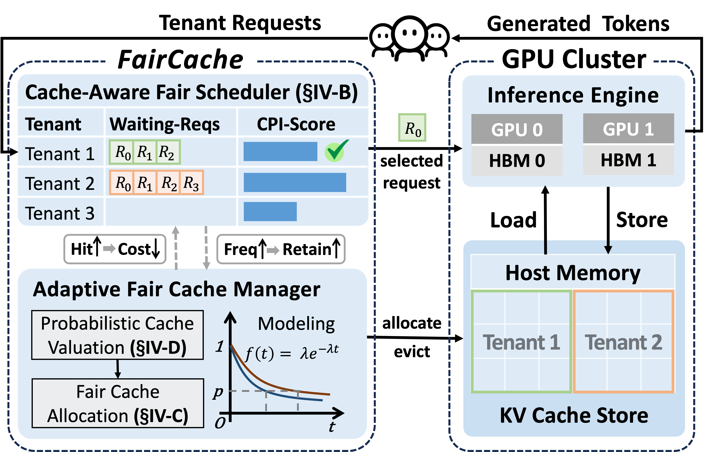

FairCache
===================================================

## Overview

**FairCache** is the first system that achieves comprehensive resource fairness in multi-tenant LLM serving with context caching. Context caching improves serving efficiency but introduces multi-dimensional resource demands (compute, memory, I/O) that existing fair schedulers do not account for, leading to unfair prioritization of high cache-hit tenants and free-riding on shared prefix prefill costs. FairCache addresses this with a **multi-dimensional resource cost model**, **dynamic cost attribution** to distribute prefill costs among benefiting tenants, and **adaptive cache management** that combines max-min fairness with reuse modeling. The result is fair access to cached working sets while keeping high serving efficiency.



## Getting Started

Clone the repository:

```bash
git clone https://github.com/icloud-ecnu/FairCache.git
cd FairCache
```

All commands below assume you are in the repository root (`FairCache/`).

## Repository Layout

This repository contains modified components to realize FairCache:

- `vllm-0.6.2/`: Modified vLLM (version 0.6.2) used as the serving engine.
- `LMCache/`: Modified LMCache library for context caching and FairCache-related primitives.
- `lmcache-vllm/`: Modified LMCache–vLLM adapter that integrates LMCache with vLLM and FairCache.
- Other scripts and configuration files: experiments, evaluation scripts, and auxiliary utilities.

## Environment Setup

FairCache builds on vLLM, LMCache, and the LMCache–vLLM driver, all installed **from the local source directories** in this repository (after cloning). Use Python ≥ 3.10 and a CUDA-enabled environment.

### 1. Create and Activate Conda Environment

```bash
conda create -n lmcache python=3.10
conda activate lmcache
```

Ensure you have a working CUDA-enabled PyTorch installation compatible with vLLM and LMCache.

### 2. Install Basic Dependencies

```bash
pip install matplotlib
pip install openai
pip install pandas
```

### 3. Install vLLM (from local source)

From the repository root:

```bash
pip install -e ./vllm-0.6.2
```

Verify:

```bash
python3 -c "import vllm; print(vllm.__name__)"
# Expected: vllm
```

### 4. Install LMCache (from local source)

```bash
pip install -e ./LMCache
```

Verify:

```bash
python3 -c "import torch; import torchac_cuda; print(torchac_cuda.__name__)"
python3 -c "import lmcache; print(lmcache.__name__)"
# Expected: torchac_cuda, lmcache
```

### 5. Install LMCache–vLLM Driver (from local source)

```bash
pip install -e ./lmcache-vllm
```

Verify:

```bash
python3 -c "import lmcache_vllm; print(lmcache_vllm.__name__)"
# Expected: lmcache_vllm
```

### 6. Check LMCache Server

```bash
python3 -c "import lmcache.server; print(lmcache.server.__name__)"
# Expected: lmcache.server
```

If all checks pass, the FairCache environment is ready.

## Starting the Server

To run the FairCache-enabled OpenAI-compatible API server, use the `lmcache_vllm` entrypoint with `--enable-fair-computation` and your chosen model and hardware settings:

```bash
python3 -m lmcache_vllm.vllm.entrypoints.openai.api_server \
  --model <model_name_or_path> \
  --port <port> \
  --gpu-memory-utilization <value> \
  --tensor-parallel-size <n> \
  --max-model-len <length> \
  --trust-remote-code \
  --enable-fair-computation
```

Replace `<model_name_or_path>`, `<port>`, `<value>`, `<n>`, and `<length>` according to your environment and workload. For experiment reproduction, see the scripts and configuration files in this repository.


